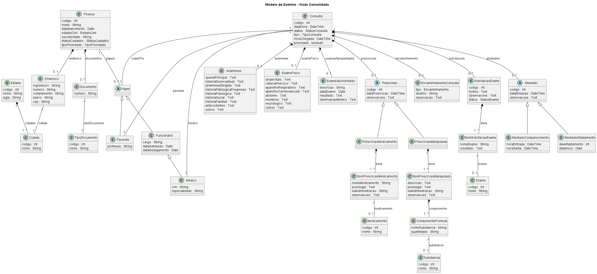

# proMed 🏥

Sistema de Clínica Médica focado em atendimento ambulatorial, com modelagem orientada a domínio (DDD) e documentação em UML.

---

## 📌 Objetivo

Modelar um sistema completo de prontuário clínico que represente com fidelidade o fluxo real de atendimento médico, mantendo equilíbrio entre:

* Estrutura
* Flexibilidade
* Usabilidade clínica

---

## 🧠 Abordagem

O projeto foi desenvolvido com base em:

* Domain-Driven Design (DDD)
* Separação de contextos (Domínio vs Suporte)
* Modelagem híbrida (estrutura + texto livre)
* Uso consistente de herança e composição
* Evolução progressiva de dados (cadastros não bloqueantes)

---

## 🖼️ Modelo de Domínio (Visão Consolidada)



> Este diagrama representa a visão completa do domínio, integrando todos os módulos do sistema.

---

## 📂 Estrutura UML

```plaintext
docs/
 └── uml/
      ├── dominio/
      │     ├── classes/
      │     │     ├── consulta_nucleo.puml
      │     │     ├── prescricao.puml
      │     │     ├── exames.puml
      │     │     ├── encaminhamento_atestado.puml
      │     │     ├── modelo_cadastral.puml
      │     │     └── modeloDominioConsolidado.puml
      │     │
      │     └── enums/
      │           └── enumsDominio.puml
      │
      ├── suporte/
      │     ├── classes/
      │     │     └── modeloSuporte.puml
      │     │
      │     └── enums/
      │           └── enumsSuporte.puml
      │
      └── use-cases/
            └── useCase.puml
```

---

## 🏗️ Principais Módulos do Domínio

### 👤 Cadastro

* Pessoa com múltiplos papéis:

  * Paciente
  * Médico
  * Funcionário
* Endereço, documentos e localização

---

### 🩺 Consulta

* Atendimento por ordem de chegada
* Relacionada a:

  * Paciente
  * Médico
  * Responsável pelo cadastro

Inclui:

* Anamnese
* Exame físico
* Exames apresentados

---

### 💊 Prescrição

Separada por tipo:

* **Prescrição de Medicamento**
* **Prescrição Manipulada**

Características:

* Medicamento pode ser cadastrado ou digitado
* Fórmulas manipuladas com múltiplos componentes
* Substâncias cadastradas ou livres

---

### 🧪 Exames

* Solicitação com múltiplos itens
* Cada item pode:

  * Referenciar exame cadastrado
  * Ou ser informado manualmente

---

### 🔄 Encaminhamento

* Direcionamento para outros profissionais ou serviços
* Destino em texto livre (flexível)

---

### 📄 Atestados

* Comparecimento
* Afastamento

---

## ⚙️ Modelo de Suporte

Permite evolução contínua do sistema sem travar o usuário:

* MedicamentoPendente
* SubstanciaPendente
* ExamePendente

---

## 📐 Decisões de Modelagem

* Uso de herança para evitar campos opcionais excessivos
* Separação clara entre domínio e suporte
* Estrutura modular de diagramas UML
* Flexibilidade para entrada de dados clínicos reais
* Consistência de padrões entre prescrição, exames e substâncias

---

## 🚀 Próximos passos

* Implementação em Java (Spring Boot)
* Mapeamento com JPA/Hibernate
* Criação de API REST
* Interface de usuário

---

## 👨‍💻 Autor

Andre Costa
